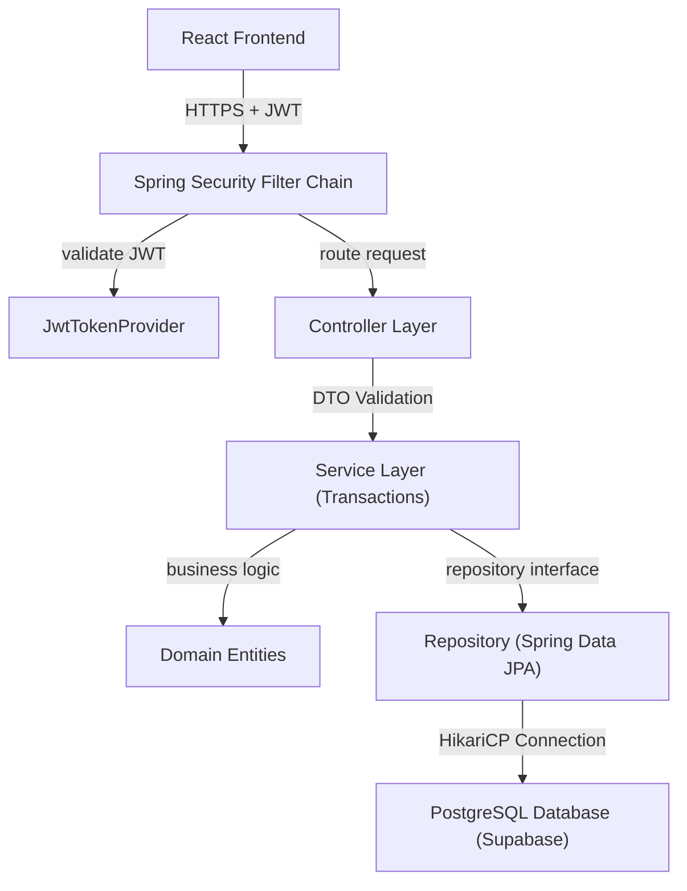
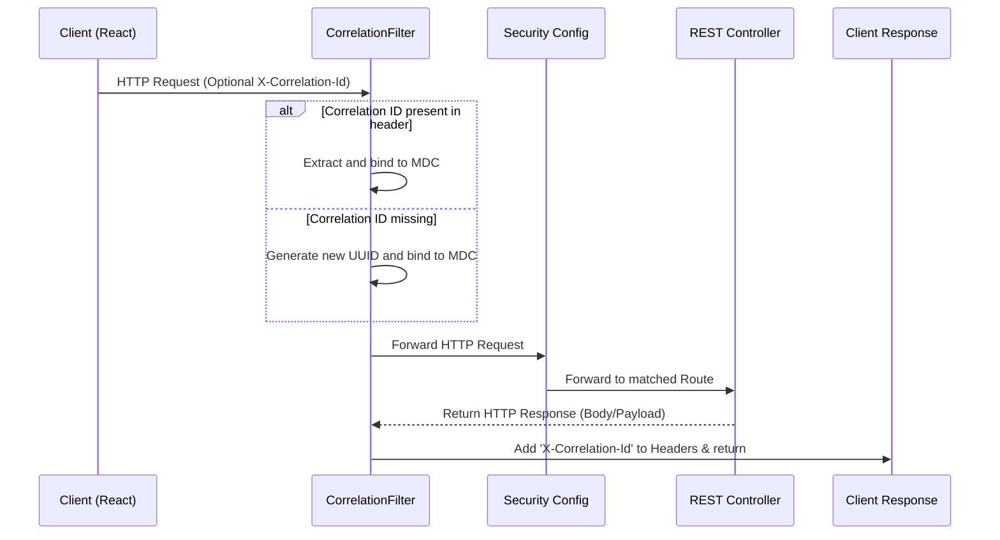
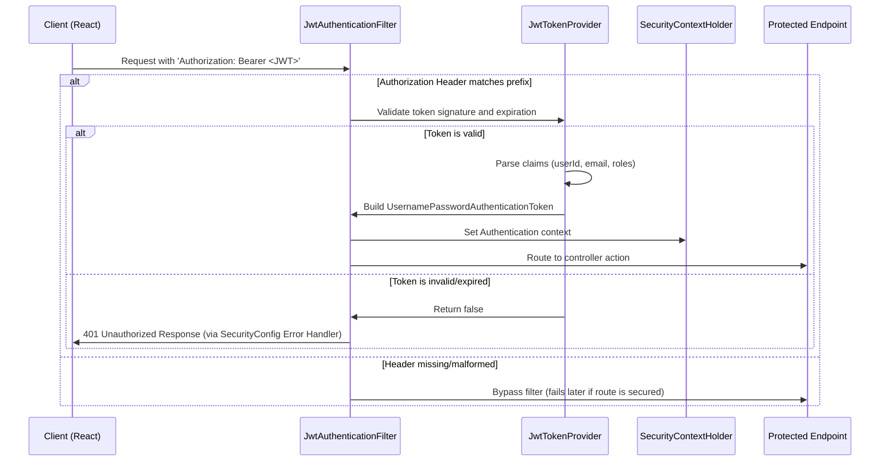
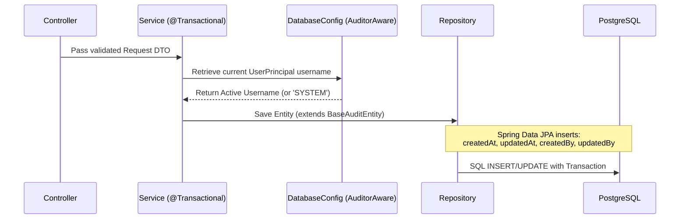

# Backend System Architecture: Fire Management System

This document outlines the architectural patterns, request-response lifecycles, and technical boundaries governing the Fire Management System backend.

---

## 1. High-Level Design Patterns

The backend is built as a **Modular Monolith** applying **Clean Architecture** and **SOLID** principles. 
The system emphasizes strict separation of concerns, high cohesion, and low coupling:

- **Modular Monolith**: Core business domains (e.g., Users, Incidents, Stations) are organized as independent, self-contained packages under `domains/`. They communicate via clean method calls (or events), facilitating eventual extraction into microservices if scale warrants it.
- **Stateless REST**: The system has zero-session-state memory. All states are verified per request using cryptographically signed JSON Web Tokens (JWTs).
- **Database Isolation**: Direct database entity exposure is prohibited. Entities are transformed into dedicated Request/Response DTOs using compile-time MapStruct mappers before entering or leaving the API layer.

---

## 2. Technical Components Diagram

The diagram below shows the high-level architecture from the React Frontend down to PostgreSQL:



---

## 3. Package & Directory Organization

```text
src/main/java/com/company/firemanagement/
├── FireManagementApplication.java
│
├── config/                     # Shared system-wide configurations
│   ├── DatabaseConfig.java     # Auditing configuration and Transaction support
│   ├── OpenApiConfig.java     # Swagger API documentation configuration
│   └── SecurityConfig.java     # CORS, HTTP Filter rules, and OAuth2 security definitions
│
├── security/                   # Authentication and Authorization middleware
│   ├── jwt/                    # JwtAuthenticationFilter & TokenProvider
│   └── principal/              # UserPrincipal representation
│
├── common/                     # Cross-cutting system modules
│   ├── entity/                 # BaseAuditEntity
│   ├── exception/              # GlobalExceptionHandler and Error codes
│   └── logging/                # CorrelationFilter
│
└── domains/                    # Business domain packages (Modular Monolith Boundaries)
    └── health/                 # Health check domain
        ├── controller/
        ├── entity/
        └── repository/
```

---

## 4. Key Lifecycles

### A. HTTP Request & Correlation Tracking

Each incoming request is stamped with a unique Correlation/Trace ID to ensure traceability across multithreaded log structures.



### B. Security & Authentication Flow

Standard stateless verification of incoming Bearer credentials:



### C. Auditing & Database Flow

All persistent modifications are timestamped and tagged with the active editor context:


