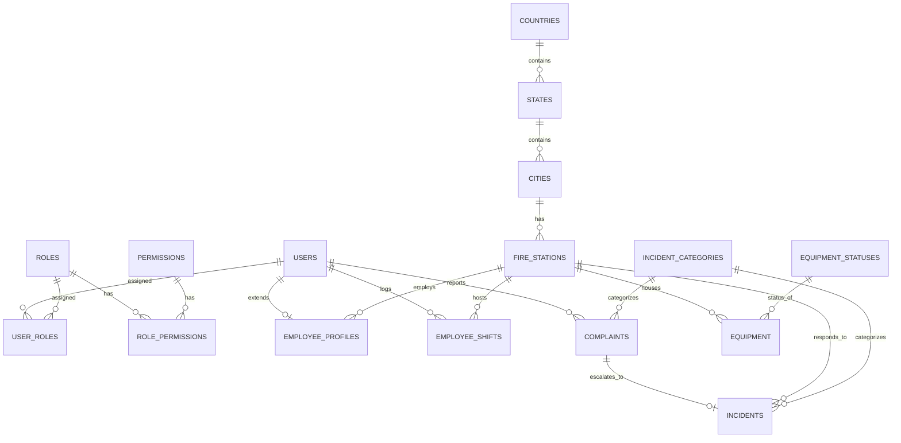

# Data Model Specification: Fire Management System

This document specifies the core entities, fields, relationships, and validation rules for the database schema.

## Entity Relationships

The core entity relationships are structured as follows:

---

## Entity Schemas

### 1. Geography & Stations Module

#### Country
- **id** (UUID, PK): Unique identifier.
- **name** (VARCHAR(100), Unique, Not Null): Country name.
- **iso_code** (VARCHAR(3), Unique, Not Null): Alpha-3 code.
- **created_at / updated_at** (TIMESTAMPTZ, Not Null).

#### State
- **id** (UUID, PK): Unique identifier.
- **country_id** (UUID, FK, Not Null): References `countries.id` (ON DELETE CASCADE).
- **name** (VARCHAR(100), Not Null): State/Province name.
- **code** (VARCHAR(10), Not Null): State code.
- **Constraints**: Composite unique constraint `(country_id, code)`.

#### City
- **id** (UUID, PK): Unique identifier.
- **state_id** (UUID, FK, Not Null): References `states.id` (ON DELETE CASCADE).
- **name** (VARCHAR(100), Not Null): City name.
- **Constraints**: Composite unique constraint `(state_id, name)`.

#### FireStation
- **id** (UUID, PK): Unique identifier.
- **city_id** (UUID, FK, Not Null): References `cities.id` (ON DELETE RESTRICT).
- **name** (VARCHAR(150), Not Null): Physical station name.
- **address** (TEXT, Not Null): Street address.
- **latitude** (NUMERIC(9, 6), Not Null): Lat coordinates. Range: `[-90.000000, 90.000000]`.
- **longitude** (NUMERIC(9, 6), Not Null): Long coordinates. Range: `[-180.000000, 180.000000]`.
- **status** (VARCHAR(50), Not Null, Default: 'ACTIVE'): Status of station.

---

### 2. User & Access Management Module (RBAC)

#### User
- **id** (UUID, PK): Unique identifier.
- **email** (VARCHAR(255), Unique, Not Null): Login email. Must be valid format.
- **username** (VARCHAR(100), Unique, Not Null): Unique username.
- **password_hash** (VARCHAR(255), Not Null): BCrypt password hash.
- **first_name / last_name** (VARCHAR(100), Not Null).
- **phone_number** (VARCHAR(30), Nullable).
- **is_active** (BOOLEAN, Not Null, Default: TRUE).

#### Role
- **id** (UUID, PK): Unique identifier.
- **name** (VARCHAR(50), Unique, Not Null): Role code (e.g. `ROLE_CITIZEN`, `ROLE_FIREFIGHTER`, `ROLE_ADMIN`).
- **description** (VARCHAR(255), Nullable).

#### Permission
- **id** (UUID, PK): Unique identifier.
- **name** (VARCHAR(100), Unique, Not Null): Permission identifier (e.g., `READ_INCIDENTS`).
- **description** (VARCHAR(255), Nullable).

#### EmployeeProfile
- **user_id** (UUID, PK, FK): References `users.id` (ON DELETE CASCADE).
- **station_id** (UUID, FK, Not Null): Home station. References `fire_stations.id` (ON DELETE RESTRICT).
- **employee_code** (VARCHAR(50), Unique, Not Null): Work identifier.

#### EmployeeShift
- **id** (UUID, PK): Unique identifier.
- **employee_id** (UUID, FK, Not Null): References `users.id` (ON DELETE CASCADE).
- **station_id** (UUID, FK, Not Null): References `fire_stations.id` (ON DELETE RESTRICT).
- **check_in_time** (TIMESTAMPTZ, Not Null, Default: CURRENT_TIMESTAMP).
- **check_out_time** (TIMESTAMPTZ, Nullable).
- **check_in_latitude** (NUMERIC(9, 6), Not Null). Range: `[-90, 90]`.
- **check_in_longitude** (NUMERIC(9, 6), Not Null). Range: `[-180, 180]`.
- **check_out_latitude / check_out_longitude** (NUMERIC(9, 6), Nullable).
- **status** (VARCHAR(50), Not Null, Default: 'ACTIVE'): Status constraint `CHECK (status IN ('ACTIVE', 'COMPLETED', 'ABNORMAL'))`.

---

### 3. Incident & Operational Module

#### IncidentCategory
- **id** (UUID, PK): Unique identifier.
- **name** (VARCHAR(100), Unique, Not Null): Classification name.
- **description** (VARCHAR(255), Nullable).

#### Complaint
- **id** (UUID, PK): Unique identifier.
- **reporter_id** (UUID, FK, Not Null): References `users.id` (ON DELETE SET NULL).
- **category_id** (UUID, FK, Not Null): References `incident_categories.id` (ON DELETE RESTRICT).
- **latitude / longitude** (NUMERIC(9, 6), Not Null).
- **severity** (VARCHAR(50), Not Null): Status constraint `CHECK (severity IN ('LOW', 'MEDIUM', 'HIGH', 'CRITICAL'))`.
- **description** (TEXT, Not Null).
- **status** (VARCHAR(50), Not Null, Default: 'PENDING'): Status constraint `CHECK (status IN ('PENDING', 'APPROVED', 'REJECTED'))`.

#### Incident
- **id** (UUID, PK): Unique identifier.
- **complaint_id** (UUID, Unique, FK, Nullable): References `complaints.id` (ON DELETE SET NULL).
- **station_id** (UUID, FK, Not Null): Responding station. References `fire_stations.id` (ON DELETE RESTRICT).
- **category_id** (UUID, FK, Not Null): References `incident_categories.id` (ON DELETE RESTRICT).
- **status** (VARCHAR(50), Not Null, Default: 'DISPATCHED'): Status constraint `CHECK (status IN ('DISPATCHED', 'IN_PROGRESS', 'RESOLVED', 'CANCELLED'))`.
- **severity** (VARCHAR(50), Not Null): Status constraint `CHECK (severity IN ('LOW', 'MEDIUM', 'HIGH', 'CRITICAL'))`.
- **latitude / longitude** (NUMERIC(9, 6), Not Null).
- **dispatched_at** (TIMESTAMPTZ, Not Null, Default: CURRENT_TIMESTAMP).
- **resolved_at** (TIMESTAMPTZ, Nullable).
- **notes** (TEXT, Nullable).

#### EquipmentStatus
- **id** (UUID, PK): Unique identifier.
- **status_name** (VARCHAR(50), Unique, Not Null): Status identifier (e.g. `AVAILABLE`, `IN_USE`).
- **description** (VARCHAR(255), Nullable).

#### Equipment
- **id** (UUID, PK): Unique identifier.
- **station_id** (UUID, FK, Not Null): References `fire_stations.id` (ON DELETE RESTRICT).
- **name** (VARCHAR(100), Not Null): Equipment designation.
- **type** (VARCHAR(100), Not Null): Category of equipment.
- **status_id** (UUID, FK, Not Null): References `equipment_statuses.id` (ON DELETE RESTRICT).
