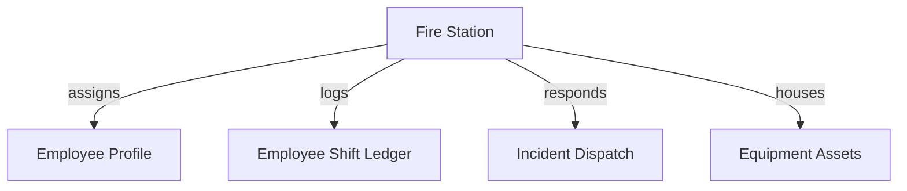
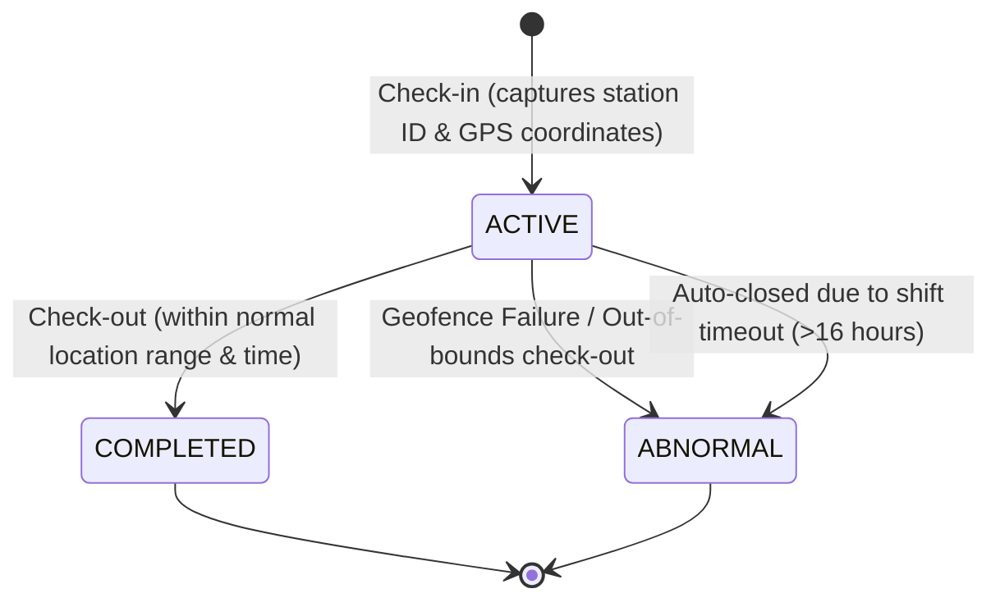
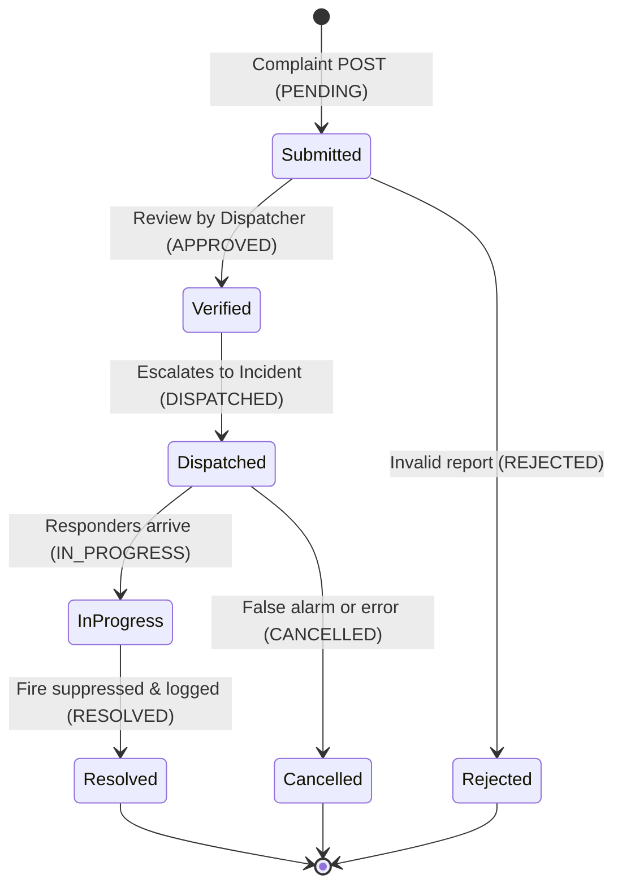

# Implementation Plan: Fire Management System

**Branch**: `002-fire-management-system` | **Date**: 2026-08-31 | **Spec**: [spec.md](file:///home/rohit/Desktop/fire-incident-backend/specs/002-fire-management-system/spec.md)

**Input**: Feature specification from [spec.md](file:///home/rohit/Desktop/fire-incident-backend/specs/002-fire-management-system/spec.md)

## Summary
Implement the core structures of a global, multi-region Fire Management System. This plan specifies the structural design, data model, state machines, and implementation phases using a Spring Boot modular monolith architecture, Spring Security + stateless JWT authentication, and a PostgreSQL database with Flyway migrations.

## Technical Context
- **Language/Version**: Java 17
- **Primary Dependencies**: Spring Boot Web Starter, Spring Boot Security Starter, Spring Boot Validation, Flyway Core, JSON Web Tokens (JJWT), PostgreSQL Driver.
- **Storage**: PostgreSQL (via Spring Data JPA and Hibernate).
- **Testing**: JUnit 5, Mockito, Spring Boot Test, and Testcontainers (PostgreSQL container for integration verification).
- **Target Platform**: Docker-ready Java runtime environment.
- **Project Type**: web-service (RESTful API).
- **Performance Goals**: JWT validation and shift telemetry check-in within < 100ms.
- **Constraints**: Enforced UTC timestamps, WGS 84 GPS coordinate ranges, stateless JWT roles/permissions claims.
- **Scale/Scope**: Dynamic support for multiple countries, states, cities, and stations (scaling to 10k+ stations).

## Constitution Check
This plan complies fully with all rules ratified in the [constitution.md](../../.specify/memory/constitution.md):
- **Core Monolith**: Implemented within the existing modular monolith codebase. No external microservices or message queues are added.
- **Domain Structure**: Arranged by functional feature packaging (e.g. `domain/user`, `domain/station`, `domain/incident`). Thin controllers delegates execution.
- **Stateless Security**: Utilizes JWT credentials in Bearer authorization headers; passwords hashed using BCrypt.
- **Database Integrity**: Schema definitions version-controlled via Flyway; constraints (Foreign Key, Unique, Check) enforced in PostgreSQL.
- **REST Exception Handling**:jakarta bean validations on request objects; responses mapped via centralized handler.

---

## SECTION 1: ARCHITECTURAL & SCALING PRINCIPLES

### 1. Multi-Region Hierarchy
The system uses a normalized regional schema (`countries` -> `states` -> `cities` -> `fire_stations`) to isolate station-level operations. 
- **Operational Level**: Day-to-day operations (firefighter shifts, equipment status, active incidents) are linked directly to `fire_stations` (the leaf node).
- **Analytical Reporting**: By tracing parent foreign keys (`city_id -> state_id -> country_id`), analytical queries can aggregate operational data at local (city), regional (state), or national (country) scopes without duplicating records or breaking regional separation.

### 2. Single-Point Connectivity
The `fire_stations` table serves as the primary master key connecting all operational modules:
- **Identity (Who)**: Active personnel are assigned to a station via `employee_profiles.station_id`.
- **Telemetry (Where)**: Firefighters check in and out of a station via `employee_shifts.station_id`, allowing real-time availability checks.
- **Operations (What)**: Incidents are dispatched to a specific responding station via `incidents.station_id`.
- **Assets (With What)**: Vehicles and gear are registered to a station via `equipment.station_id`.



### 3. Extensibility Strategy
Future extensions (e.g., drone telemetry, hydrant registries, maintenance schedules) can hook into the core schema without breaking existing tables:
- **Drone Telemetry**: Create a `drone_telemetry` table linked to `incidents.id` or `fire_stations.id` with timestamped coordinate logs.
- **Vehicle Maintenance**: Create a `maintenance_records` table referencing `equipment.id`.
This structural separation keeps the core geography, auth, and incident tables isolated and stable.

---

## SECTION 2: COMPREHENSIVE DATA DICTIONARY PLAN

### 1. Core/Master Domain Module
- **countries**: Defines sovereign country boundaries.
  - `id` (UUID, PK)
  - `name` (VARCHAR(100), Unique, Not Null)
  - `iso_code` (VARCHAR(3), Unique, Not Null)
- **states**: Defines state/province boundaries.
  - `id` (UUID, PK)
  - `country_id` (UUID, FK referencing `countries.id`, ON DELETE CASCADE, Not Null)
  - `name` (VARCHAR(100), Not Null)
  - `code` (VARCHAR(10), Not Null)
  - Unique constraint on `(country_id, code)`
- **cities**: Defines city/district boundaries.
  - `id` (UUID, PK)
  - `state_id` (UUID, FK referencing `states.id`, ON DELETE CASCADE, Not Null)
  - `name` (VARCHAR(100), Not Null)
  - Unique constraint on `(state_id, name)`
- **fire_stations**: Master station directory.
  - `id` (UUID, PK)
  - `city_id` (UUID, FK referencing `cities.id`, ON DELETE RESTRICT, Not Null)
  - `name` (VARCHAR(150), Not Null)
  - `address` (TEXT, Not Null)
  - `latitude` (NUMERIC(9,6), Not Null CHECK -90 to 90)
  - `longitude` (NUMERIC(9,6), Not Null CHECK -180 to 180)
  - `status` (VARCHAR(50), Not Null DEFAULT 'ACTIVE')
- **incident_categories**: Reference classifications.
  - `id` (UUID, PK)
  - `name` (VARCHAR(100), Unique, Not Null) -- e.g., 'WILDFIRE', 'HAZMAT'
  - `description` (VARCHAR(255))
- **equipment_statuses**: Reference equipment availability states.
  - `id` (UUID, PK)
  - `status_name` (VARCHAR(50), Unique, Not Null) -- e.g., 'AVAILABLE', 'MAINTENANCE'

### 2. Identity & Access Module (RBAC)
- **users**: Unified accounts table.
  - `id` (UUID, PK)
  - `email` (VARCHAR(255), Unique, Not Null)
  - `username` (VARCHAR(100), Unique, Not Null)
  - `password_hash` (VARCHAR(255), Not Null)
  - `first_name` (VARCHAR(100), Not Null)
  - `last_name` (VARCHAR(100), Not Null)
  - `phone_number` (VARCHAR(30))
  - `is_active` (BOOLEAN, Not Null DEFAULT TRUE)
- **roles**: System roles mapping.
  - `id` (UUID, PK)
  - `name` (VARCHAR(50), Unique, Not Null) -- e.g., 'ROLE_CITIZEN', 'ROLE_FIREFIGHTER'
- **permissions**: System permissions mapping.
  - `id` (UUID, PK)
  - `name` (VARCHAR(100), Unique, Not Null) -- e.g., 'READ_INCIDENTS'
- **user_roles**: Junction table for user roles.
  - `user_id` (UUID, FK referencing `users.id`, ON DELETE CASCADE)
  - `role_id` (UUID, FK referencing `roles.id`, ON DELETE CASCADE)
  - PK is `(user_id, role_id)`
- **role_permissions**: Junction table for role permissions.
  - `role_id` (UUID, FK referencing `roles.id`, ON DELETE CASCADE)
  - `permission_id` (UUID, FK referencing `permissions.id`, ON DELETE CASCADE)
  - PK is `(role_id, permission_id)`
- **employee_profiles**: Professional profile.
  - `user_id` (UUID, PK, FK referencing `users.id`, ON DELETE CASCADE)
  - `station_id` (UUID, FK referencing `fire_stations.id`, ON DELETE RESTRICT, Not Null)
  - `employee_code` (VARCHAR(50), Unique, Not Null)
- **employee_shifts**: Shift ledger logs.
  - `id` (UUID, PK)
  - `employee_id` (UUID, FK referencing `users.id`, ON DELETE CASCADE, Not Null)
  - `station_id` (UUID, FK referencing `fire_stations.id`, ON DELETE RESTRICT, Not Null)
  - `check_in_time` (TIMESTAMPTZ, Not Null DEFAULT CURRENT_TIMESTAMP)
  - `check_out_time` (TIMESTAMPTZ)
  - `check_in_latitude` (NUMERIC(9,6), Not Null)
  - `check_in_longitude` (NUMERIC(9,6), Not Null)
  - `check_out_latitude` (NUMERIC(9,6))
  - `check_out_longitude` (NUMERIC(9,6))
  - `status` (VARCHAR(50), Not Null DEFAULT 'ACTIVE' CHECK IN ACTIVE, COMPLETED, ABNORMAL)

### 3. Operations Module
- **complaints**: Citizen submissions.
  - `id` (UUID, PK)
  - `reporter_id` (UUID, FK referencing `users.id`, ON DELETE SET NULL, Not Null)
  - `category_id` (UUID, FK referencing `incident_categories.id`, ON DELETE RESTRICT, Not Null)
  - `latitude` (NUMERIC(9,6), Not Null)
  - `longitude` (NUMERIC(9,6), Not Null)
  - `severity` (VARCHAR(50), Not Null CHECK IN LOW, MEDIUM, HIGH, CRITICAL)
  - `description` (TEXT, Not Null)
  - `status` (VARCHAR(50), Not Null DEFAULT 'PENDING' CHECK IN PENDING, APPROVED, REJECTED)
- **incidents**: Active responder operations.
  - `id` (UUID, PK)
  - `complaint_id` (UUID, Unique, FK referencing `complaints.id`, ON DELETE SET NULL)
  - `station_id` (UUID, FK referencing `fire_stations.id`, ON DELETE RESTRICT, Not Null)
  - `category_id` (UUID, FK referencing `incident_categories.id`, ON DELETE RESTRICT, Not Null)
  - `status` (VARCHAR(50), Not Null DEFAULT 'DISPATCHED' CHECK IN DISPATCHED, IN_PROGRESS, RESOLVED, CANCELLED)
  - `severity` (VARCHAR(50), Not Null CHECK IN LOW, MEDIUM, HIGH, CRITICAL)
  - `latitude` (NUMERIC(9,6), Not Null)
  - `longitude` (NUMERIC(9,6), Not Null)
  - `dispatched_at` (TIMESTAMPTZ, Not Null DEFAULT CURRENT_TIMESTAMP)
  - `resolved_at` (TIMESTAMPTZ)
  - `notes` (TEXT)
- **equipment**: Active station assets.
  - `id` (UUID, PK)
  - `station_id` (UUID, FK referencing `fire_stations.id`, ON DELETE RESTRICT, Not Null)
  - `name` (VARCHAR(100), Not Null)
  - `type` (VARCHAR(100), Not Null)
  - `status_id` (UUID, FK referencing `equipment_statuses.id`, ON DELETE RESTRICT, Not Null)

---

## SECTION 3: RESTful API LIFECYCLE & STATE FLIGHTS

### 1. User Onboarding Flow
1. **Submit Details**: User submits details via `POST /auth/register` with preferred roles (Citizen, Firefighter, Station Admin).
2. **Dynamic Check**: 
   - If role contains `ROLE_FIREFIGHTER` or `ROLE_ADMIN`, request must include `station_id` and `employee_code`.
   - Backend queries database to verify station presence and uniqueness of `employee_code`.
3. **Database Write**: User details saved in `users` table; password hashed via BCrypt. If employee, `employee_profiles` entry is populated. Junction `user_roles` entries written.
4. **Token Generation**: User authenticates via `POST /auth/login`, returning stateless JWT containing username, database ID, and role list claims.

### 2. Shift State Machine
Firefighter shifts transition as follows:



- **Checked-Out**: Default state; employee has no active record.
- **ACTIVE**: Set upon successful POST check-in. Captures start time and latitude/longitude.
- **COMPLETED**: Updated upon PATCH check-out. Enforces that check-out coordinates are within 500m geofence of target station.
- **ABNORMAL**: Set if check-out GPS check fails, or if shift exceeds maximum duration (16h) without checkout.

### 3. Incident Lifecycle States
Complaints submitted by citizens progress through validation to closure:



---

## SECTION 4: STEP-BY-STEP IMPLEMENTATION ROADMAP

### Phase 1: Core Master Data & RBAC Foundations
- **Milestone 1.1: Database Migration**: Write and run Flyway script `V2__fire_management_core.sql` to initialize all geography, station, user, role, and lookup tables.
- **Milestone 1.2: Authentication Engine**: Set up Spring Security configurations, password encoder, and JWT token provider class.
- **Milestone 1.3: User Onboarding Controllers**: Implement registration (`POST /api/v1/auth/register`) with dynamic validation checks and login (`POST /api/v1/auth/login`) returning valid token.

### Phase 2: Employee Shift Logging & Station-Level Tracking
- **Milestone 2.1: Shift Ledger Entities**: Build `EmployeeShift` model, JPA repository, and service layer.
- **Milestone 2.2: Geofencing Utility**: Implement spatial calculation utility to verify check-in coordinates against station coordinates.
- **Milestone 2.3: Shift Check-In/Out API**: Build secured routes `POST /api/v1/shifts/check-in` and `PATCH /api/v1/shifts/check-out`.

### Phase 3: Public Complaints & Operational Incident Management
- **Milestone 3.1: Complaint Submission API**: Expose citizen endpoint to submit complaints with location coordinates.
- **Milestone 3.2: Incident Escalation & Dispatch**: Create backend services for dispatcher to approve complaints, generate incidents, and assign responding stations.
- **Milestone 3.3: Incident Lifecycle API**: Expose status transition updates for responding crews.

### Phase 4: Regional Expansion & Global Scaling Analytics
- **Milestone 4.1: Spatial Indexes**: Add PostGIS or PostgreSQL spatial indexes on coordinates to support geographical distance-query optimization.
- **Milestone 4.2: Regional Reports**: Create aggregation endpoints allowing national and state admins to run queries on active incidents and firefighter counts.

---

## Project Structure
```text
src/
├── main/
│   ├── java/
│   │   └── com/example/fire/
│   │       ├── config/               # Security & JWT configurations
│   │       ├── domain/
│   │       │   ├── user/             # Users, Roles, and Registration logic
│   │       │   ├── station/          # Countries, States, Cities, Stations
│   │       │   └── incident/         # Complaints, Incidents, Categories
│   │       └── exception/            # Central exception handlers
│   └── resources/
│       ├── db/migration/             # Flyway SQL migrations
│       └── application.yml           # App properties
```

## Complexity Tracking
*No constitutional violations identified. Design is fully compliant.*
